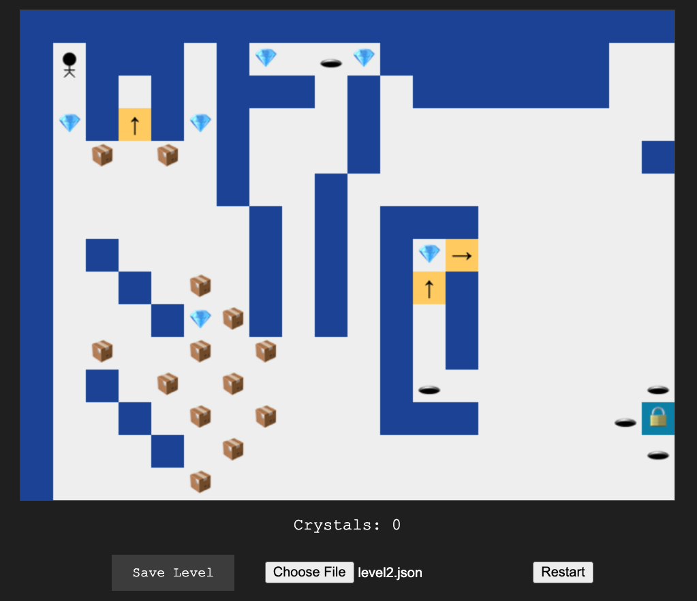

# runaround-js
My "Runaround" game implemented in HTML5/JS as a test of code generation assistance tools

The 'runaround' game concept is a project that I have been implementing
and re-implementing since I was 14 years old (in 1994).



## Directions to play:

* Use the arrow keys to navigate
* Gather all the crystals until the exit opens, then go into the exit
* Push blocks into holes to make both disappear
* Don't fall into holes, or you'll die
* One way doors are just what they look and sound like
* Walk through doors to travel between connected boards
* If you get stuck, you can reset the current board by clicking on 'Restart'

## Demo

[Hosted on Github Pages](https://dolan.github.io/runaround-js/)

### Make your own Levels
You can save and load level files
* Start by saving or using one of the included levels as a starting point
* edit the tiles arrays using the symbols below


|Symbol|Meaning|Walkable?|
|------|-------------|-------|
| "." | Empty square | Yes |
| "w" | Wall | No |
| "p" | Player | n/a |
| "c" | Crystal | Yes |
| "x" | Exit | Yes (when crystals collected) |
| "d" | Door (world transition) | Yes |
| "ol" | One-way left | Yes |
| "or" | One-way right | Yes |
| "ou" | One-way up | Yes |
| "od" | One-way down | Yes |
| "h" | Hole | No |
| "m" | Movable Box | Yes |

Specify the number of required crystals as "required_crystals" element in the `level.json`
```json
{
  "tiles": [
    ["w", "w", "w", "w", "w", "w", "w", "w", "w", "w", "w", "w", "w", "w"],
    ["w", "p", ".", ".", "m", ".", "w", "w", "w", "w", ".", ".", ".", "w"],
    ["w", ".", "ol", ".", "or", ".", ".", "w", "w", "w", ".", ".", ".", "w"],
    ["w", "c", "ou", "h", "od", "c", "w", ".", ".", ".", ".", ".", "od", "w"],
    ["w", ".", "m", ".", "m", ".", ".", ".", ".", ".", ".", "w", "c", "w"],
    ["w", ".", ".", ".", ".", "x", "w", ".", ".", ".", ".", ".", ".", "w"],
    ["w", "w", "w", "w", "w", "w", "w", "w", "w", "w", "w", "w", "w", "w"]
  ],
  "required_crystals": 3
}
```
The board can be any rectangular dimensions, but if you make it too big, it takes long to draw and flickers.

## World Graph System

The game supports a connected world of boards via a `world.json` file in `public/levels/`. When present, the game starts in **world mode** — boards are connected by transitions and the player explores freely instead of advancing through levels sequentially. When `world.json` is absent, the game falls back to **legacy mode** (levels 1-7 in order).

### How it works

* `x` (exit) tiles and `d` (door) tiles can be linked to other boards via transitions defined in `world.json`
* Exit tiles still require all crystals to be collected before transitioning
* Door tiles allow free passage — walk onto them to transition immediately
* The minimap in the top-right corner shows your position in the world (red = current board, green = visited, gray = unvisited)
* Board state resets each time you enter a board (crystals respawn, blocks reset)
* The current board name is displayed in the game info area

### world.json format

```json
{
  "startBoard": "clearing",
  "boards": {
    "clearing": {
      "file": "levels/world_clearing.json",
      "name": "The Clearing",
      "gridPosition": { "x": 0, "y": 0 }
    },
    "cave": {
      "file": "levels/world_cave.json",
      "name": "Crystal Cave",
      "gridPosition": { "x": 1, "y": 0 }
    }
  },
  "transitions": [
    {
      "from": { "board": "clearing", "x": 5, "y": 5, "type": "exit" },
      "to":   { "board": "cave", "x": 2, "y": 1 }
    },
    {
      "from": { "board": "cave", "x": 1, "y": 1, "type": "door" },
      "to":   { "board": "clearing", "x": 1, "y": 1 }
    }
  ]
}
```

* **startBoard**: The board ID the player begins on
* **boards**: Map of board IDs to their metadata (`file` path, display `name`, `gridPosition` for the minimap)
* **transitions**: Array of one-way connections. Each has a `from` (board, tile x/y, transition type) and `to` (board, destination x/y). Create two transitions for bidirectional connections.
* **type**: `"exit"` for crystal-gated exit tiles, `"door"` for freely-walkable door tiles

### Creating a connected world

1. Create board JSON files with `d` and/or `x` tiles at transition points
2. Create a `world.json` mapping boards and transitions
3. Place all files in `public/levels/`
4. The game automatically detects `world.json` and switches to world mode

## The timeline of Runaround
* 1994 - Originally implemented in Lightspeed C on a Mac Classic
   - The levels were designed by Rob Dolan (my brother)
* 2000 - Reimplemented in Borland C++ 5.0
* 2002 - Implemented again in Visual Basic 6.0
* 2005 - Implemented in ASP.NET MVC using C#, yes that was weird
* 2023 - September - Wrote the spec as a prompt, which is included in this repo
     - ChatGPT with GPT 4.0 was able to reason about how to construct
       the app, but was not able to build it for me in any working form
* 2024 - January - Claude 2.0 is able to reason about the app in more
       detail than was GPT 4.0, but still doesn't generate working code
     - April   - Claude 3.0 Opus is able to generate code to render the board
               - Mixtral 8x7B is able to generate code to render the
                 board
     - May     - GPT 4o (omni) is able to generate code to render the
               board, faulty, but working key stroke handling to move
               the player around. Game ending doesn't work, movement is
               super buggy.
     - June 23 - Claude 3.5 Sonnet is able to generate the mostly working
               game in one shot. I asked it to render the tiles using
               glyphs on raw background (one extra 1-line prompt in addition to
               spec file included in this repo)
     - June 25 - Claude 3.5 Sonnet and I have cycled through about 10 more times
               - added the arbitrary board size / scalable viewport
               - save to file (load from file coming soon)
    - June 26 - Split into multiple files for easier dev
               - index.html is the new starting point
               - leaving runaround.html in the repo for reference
               - loading levels works


    
